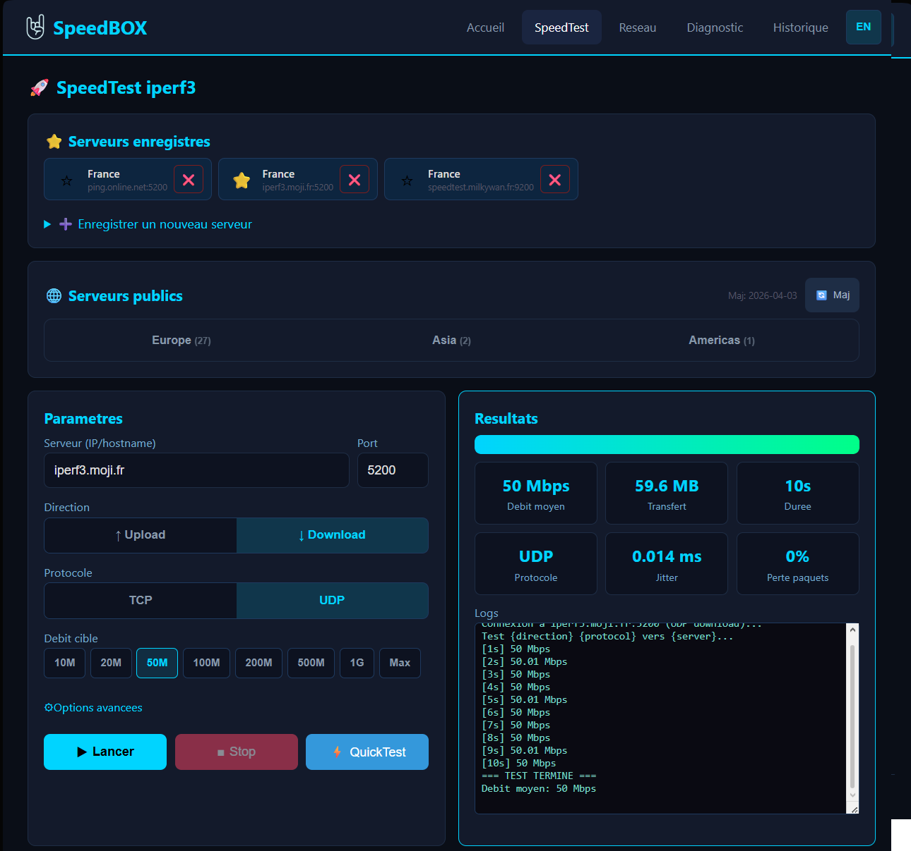
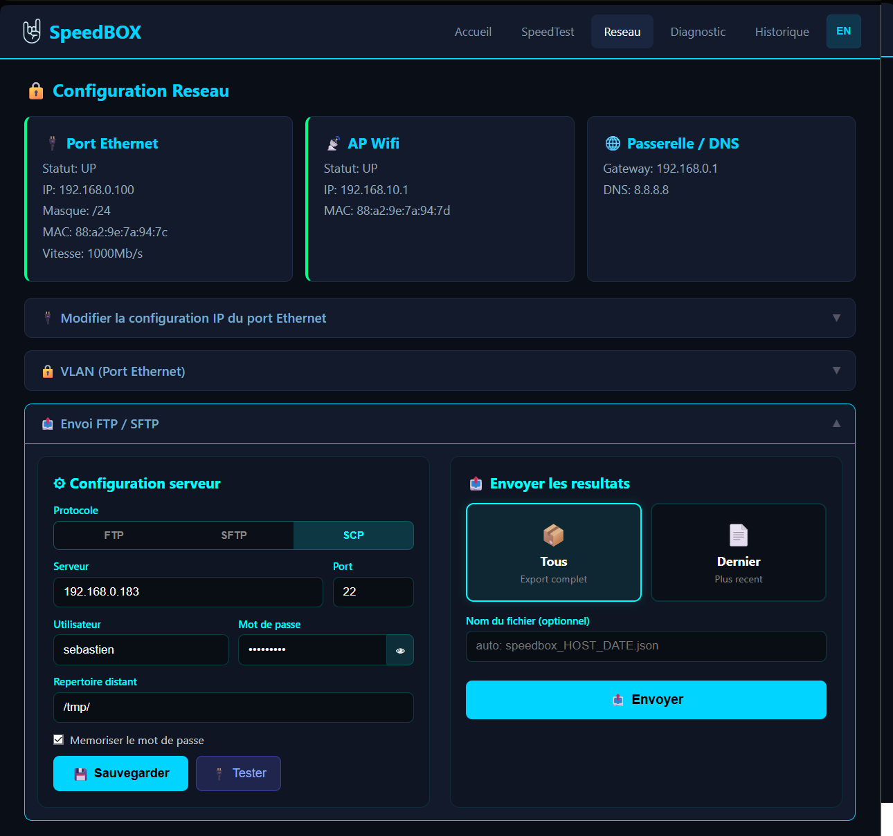
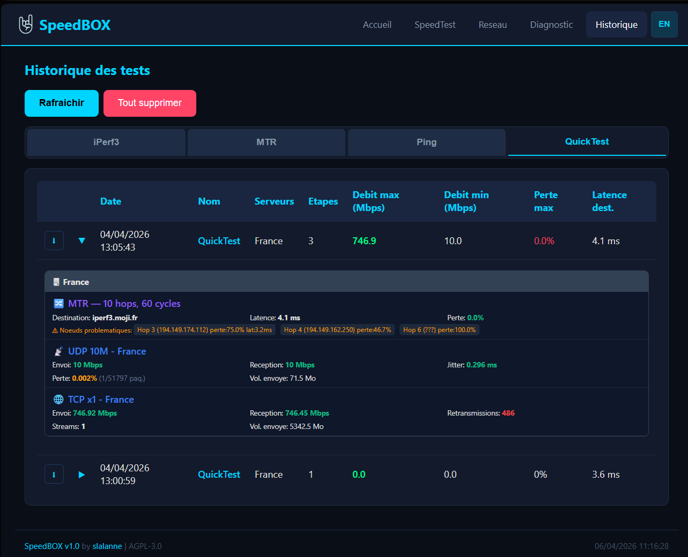

# SpeedBox

> Application web de test réseau et diagnostic pour Raspberry Pi et SBC
> *Network speed testing & diagnostics web app for Raspberry Pi and SBCs*

[](LICENSE)
[](https://python.org)
[](https://hub.docker.com/r/seblalanne/speedbox)
[](https://www.raspberrypi.com/)
[](#)


---

## Fonctionnalités / Features

- **Tests de débit / Speed Tests** — iperf3 TCP/UDP, upload/download, multi-stream, serveurs publics et privés
- **QuickTest** — Séquence automatisée : MTR + UDP + TCP mono + TCP multi par serveur favori
- **Diagnostics réseau / Network Diagnostics** — MTR (analyse par hop, détection de spikes), Ping temps réel, DNS lookup
- **Configuration réseau / Network Config** — IP statique/DHCP, gestion VLAN, affichage statut interfaces
- **Export FTP/SFTP** — Envoi des résultats vers un serveur distant
- **Historique / History** — Graphiques Chart.js, tableaux, filtrage par type de test
- **Interface bilingue / Bilingual UI** — Français et Anglais, toggle instantané
- **Thème dark responsive** — Desktop + mobile avec barre de navigation adaptative
- **Point d'accès WiFi / WiFi AP** — SSID `SpeedBox`, portail captif (ouverture auto navigateur iOS/Android/Windows)

---

## Démarrage rapide / Quick Start

### Option 1 — Image DietPi pré-construite (Raspberry Pi 5) / Pre-built DietPi image

Télécharger la dernière image depuis les [Releases GitHub](https://github.com/dashand/speedbox/releases) et la flasher avec [Raspberry Pi Imager](https://www.raspberrypi.com/software/) ou [balenaEtcher](https://etcher.balena.io/).

*Download the latest image from [GitHub Releases](https://github.com/dashand/speedbox/releases) and flash it with [Raspberry Pi Imager](https://www.raspberrypi.com/software/) or [balenaEtcher](https://etcher.balena.io/).*

Carte SD ≥ 16 Go requise. Au premier démarrage (~5 min), SpeedBox est accessible sur :

*SD card ≥ 16 GB required. On first boot (~5 min), SpeedBox is available at:*

- **Port Ethernet** : `http://<IP-du-Pi>:5000`
- **WiFi AP** : connectez-vous au réseau `SpeedBox` (mdp : `speedbox`) — le navigateur s'ouvre automatiquement

---

### Option 2 — Docker (Linux, amd64 / arm64)

```bash
# Démarrage rapide / Quick start
docker run -d --name speedbox \
  --network host --privileged \
  -v speedbox-config:/opt/speedbox/config \
  -v speedbox-results:/opt/speedbox/results \
  seblalanne/speedbox

# Ou avec docker compose / Or with docker compose
docker compose up -d
```

SpeedBox est accessible sur `http://localhost:5000`

Images disponibles sur :
- Docker Hub : `seblalanne/speedbox`
- GitHub Container Registry : `ghcr.io/dashand/speedbox`

Voir [README.docker.md](README.docker.md) pour la documentation complète Docker.

*See [README.docker.md](README.docker.md) for full Docker documentation.*

---

### Option 3 — Installation manuelle (Debian 12+ / DietPi)

```bash
# 1. Prérequis système / System prerequisites
sudo apt install iperf3 mtr traceroute ethtool dnsutils python3 python3-venv

# 2. Cloner le dépôt / Clone the repository
sudo git clone https://github.com/dashand/speedbox.git /opt/speedbox
cd /opt/speedbox

# 3. Environnement Python / Python environment
python3 -m venv venv
source venv/bin/activate
pip install -r requirements.txt

# 4. Créer les dossiers de config et résultats / Create config and results dirs
mkdir -p config results

# 5. Service systemd / Systemd service
sudo cp speedbox.service /etc/systemd/system/
sudo systemctl daemon-reload
sudo systemctl enable speedbox
sudo systemctl start speedbox
```

SpeedBox est accessible sur `http://<IP>:5000`

*SpeedBox is available at `http://<IP>:5000`*

---

## Installation automatique DietPi / DietPi Automatic Install

Le dossier [`image/`](image/) contient un script d'installation 100% automatique pour DietPi.
Il installe SpeedBox, configure le point d'accès WiFi (`SpeedBox` / `speedbox`) et active le portail captif au premier boot.

*The [`image/`](image/) folder contains a fully automatic install script for DietPi.
It installs SpeedBox, configures the WiFi AP (`SpeedBox` / `speedbox`) and enables captive portal on first boot.*

---

## Architecture

```
Browser (HTML/JS/CSS)
    |
    |-- HTTP (REST API)
    |-- WebSocket (Socket.IO)
    |
Flask + Flask-SocketIO (gevent)
    |
    |-- subprocess --> iperf3, mtr, ping, traceroute, nslookup
    |-- filesystem --> results/*.json, config/, servers.json
    |-- network    --> ip, ethtool, ifup/ifdown
```

**Stack technique / Tech Stack :**
- **Backend** : Flask 3.1, Flask-SocketIO 5.6, gevent (async), Python 3.13
- **Frontend** : Vanilla JS, Chart.js, Socket.IO client, i18n maison
- **Pas de build step** : pas de npm, webpack ou bundler — clone et run

---

## Documentation

### Français
- [Architecture](docs/fr/ARCHITECTURE.md) — Vue d'ensemble, flux de données, sécurité
- [Référence des fichiers](docs/fr/FILE_REFERENCE.md) — Rôle de chaque fichier, routes, handlers
- [Algorithmes](docs/fr/ALGORITHMS.md) — MTR, QuickTest, iperf3, config réseau, i18n
- [Guide d'installation](docs/fr/INSTALLATION.md) — Prérequis, étapes, vérification
- [Guide de personnalisation](docs/fr/CUSTOMIZATION.md) — Ajouter une langue, changer le thème, étendre

### English
- [Architecture](docs/en/ARCHITECTURE.md) — Overview, data flow, security
- [File Reference](docs/en/FILE_REFERENCE.md) — Each file's role, routes, handlers
- [Algorithms](docs/en/ALGORITHMS.md) — MTR, QuickTest, iperf3, network config, i18n
- [Installation Guide](docs/en/INSTALLATION.md) — Prerequisites, steps, verification
- [Customization Guide](docs/en/CUSTOMIZATION.md) — Add language, change theme, extend

---

## Captures d'écran / Screenshots

### Accueil / Home


### Test de débit / Speed Test


### Diagnostic


### Configuration réseau / Network


### Historique / History


---

## Contribuer / Contributing

Voir [CONTRIBUTING.md](CONTRIBUTING.md) pour les guidelines.

*See [CONTRIBUTING.md](CONTRIBUTING.md) for guidelines.*

---

## Licence / License

Ce projet est sous licence **GNU Affero General Public License v3.0** (AGPL-3.0-only).

*This project is licensed under the **GNU Affero General Public License v3.0** (AGPL-3.0-only).*

Cela signifie :
- Vous pouvez utiliser, modifier et redistribuer SpeedBox librement
- Si vous distribuez ou rendez accessible une version modifiée (y compris via un réseau), vous **devez** partager le code source sous la même licence
- Aucune garantie n'est fournie

*This means:*
- *You can freely use, modify and redistribute SpeedBox*
- *If you distribute or make a modified version available (including over a network), you **must** share the source code under the same license*
- *No warranty is provided*

Voir le fichier [LICENSE](LICENSE) pour le texte complet.

---

## Auteur / Author

**slalanne** — [LinkedIn](https://www.linkedin.com/in/slalanne/)

SpeedBox est conçu pour Raspberry Pi 5 avec DietPi, mais fonctionne sur tout système Linux (Debian 12+, Ubuntu, SBC arm64) — y compris via Docker.

*SpeedBox is designed for Raspberry Pi 5 with DietPi, but runs on any Linux system (Debian 12+, Ubuntu, arm64 SBCs) — including via Docker.*
